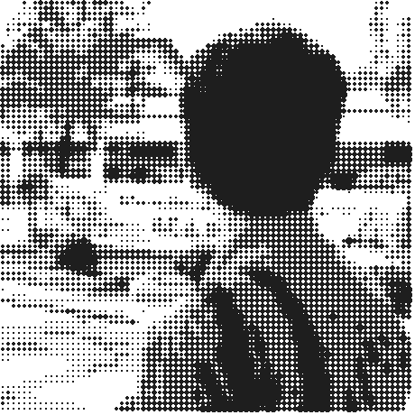

<!-- ========================================== -->
<!-- KIER BARDELOSA — EDITORIAL MONOCHROME BIO  -->
<!-- ========================================== -->

<table>
  <tr>
    <td width="36%" align="center" valign="middle">
      <picture>
        <source media="(prefers-color-scheme: dark)" srcset="./avatar-halftone-light.png" />
        <source media="(prefers-color-scheme: light)" srcset="./avatar-halftone-dark.png" />
        
      </picture>
    </td>
    <td width="64%" valign="middle">
      <h1>Kier Bardelosa</h1>
      <p>
        I'm a UI/UX designer, front-end developer, and aspiring cloud engineer.
        Currently pursuing Information Technology at the Polytechnic University of the Philippines.
      </p>
      <p>
        Right now I'm building modern cloud solutions, scalable architectures, and web apps.
        I love turning rough ideas into intuitive things people actually use.
      </p>
      <p>
        <a href="https://kierbardelosa-portfolio.vercel.app/">portfolio ↗</a> &nbsp;/&nbsp;
        <a href="https://linkedin.com/in/kierbardelosa">linkedin ↗</a> &nbsp;/&nbsp;
        <a href="https://github.com/somnium132">github ↗</a> &nbsp;/&nbsp;
        <a href="mailto:kier.bardelosa02@gmail.com">email ↗</a>
      </p>
    </td>
  </tr>
</table>

<br/>

<!-- ==================== METRIC BAR ==================== -->
<table width="100%">
  <tr>
    <td width="25%" align="center">
      <h3>1.35 <sup>↗</sup></h3>
      <sub>GWA · PRESIDENT'S LIST</sub>
    </td>
    <td width="25%" align="center">
      <h3>1st <sup>↗</sup></h3>
      <sub>HACKATHON CHAMPION</sub>
    </td>
    <td width="25%" align="center">
      <h3>3x <sup>↗</sup></h3>
      <sub>AWS & DATACAMP SCHOLAR</sub>
    </td>
    <td width="25%" align="center">
      <h3>PUP <sup>↗</sup></h3>
      <sub>BSIT · SANTA ROSA</sub>
    </td>
  </tr>
</table>

<div align="center">
  <sub>· &nbsp; · &nbsp; · &nbsp; · &nbsp; · &nbsp; · &nbsp; · &nbsp; · &nbsp; · &nbsp; · &nbsp; · &nbsp; · &nbsp; · &nbsp; · &nbsp; · &nbsp; · &nbsp; · &nbsp; · &nbsp; · &nbsp; · &nbsp; · &nbsp; · &nbsp; · &nbsp; · &nbsp; · &nbsp; · &nbsp; · &nbsp; · &nbsp; · &nbsp; · &nbsp; · &nbsp; · &nbsp; · &nbsp; · &nbsp; · &nbsp; · &nbsp; · &nbsp; · &nbsp; · &nbsp; · &nbsp; · &nbsp; · &nbsp; · &nbsp; · &nbsp; · &nbsp; · &nbsp; ·</sub>
</div>

<br/>

### 01 — projects

<table>
  <tr>
    <td>
      <b><a href="https://github.com/somnium132">SurveyLang</a></b> — <i>1st Place Champion, HACKATIVE: The Algorithm Arena</i><br/>
      University-exclusive points-based survey exchange platform with PUP webmail verification and automated point crediting.<br/>
      <sub><code>React</code> &nbsp;<code>Node.js</code> &nbsp;<code>Express</code> &nbsp;<code>MongoDB</code> &nbsp;<code>Figma</code> &nbsp;<code>Vercel</code></sub>
    </td>
    <td align="right" valign="top">
      <code>2025 ↗</code>
    </td>
  </tr>
  <tr>
    <td>
      <b><a href="https://github.com/somnium132">SkillSwap PUP</a></b> — <i>Top 4 Nationally, Solar Power Hackathon</i><br/>
      Peer-to-peer collaborative task and skill exchange system built specifically for university students.<br/>
      <sub><code>Python</code> &nbsp;<code>FastAPI</code> &nbsp;<code>AWS Boto3</code> &nbsp;<code>Uvicorn</code> &nbsp;<code>Pytest</code></sub>
    </td>
    <td align="right" valign="top">
      <code>2025 ↗</code>
    </td>
  </tr>
  <tr>
    <td>
      <b><a href="https://frostbyte-hackathon-dp-blast.vercel.app/">FROSTBYTE DP Blast</a></b> — <i>Lead Developer & UI Designer</i><br/>
      Official client-side image rendering engine for Santa Rosa City's youth innovation hackathon DP blast.<br/>
      <sub><code>HTML5 Canvas API</code> &nbsp;<code>Next.js</code> &nbsp;<code>React</code> &nbsp;<code>Tailwind CSS</code></sub>
    </td>
    <td align="right" valign="top">
      <code>2026 ↗</code>
    </td>
  </tr>
  <tr>
    <td>
      <b><a href="https://kierbardelosa-portfolio.vercel.app/">Personal Portfolio</a></b> — <i>Interactive AI Showcase</i><br/>
      Studio portfolio featuring a conversational Google Gemini AI companion, real-time Supabase guestbook, and Framer Motion.<br/>
      <sub><code>Next.js 16</code> &nbsp;<code>React 19</code> &nbsp;<code>TypeScript</code> &nbsp;<code>Tailwind</code> &nbsp;<code>Supabase</code> &nbsp;<code>Gemini AI</code></sub>
    </td>
    <td align="right" valign="top">
      <code>2026 ↗</code>
    </td>
  </tr>
</table>

<br/>

### 02 — experience & leadership

<table>
  <tr>
    <td>
      <b>FlyRank AI</b><br/>
      <i>Front-End AI Engineer Intern</i><br/>
      <sub>Building responsive, mobile-first e-commerce storefronts with React, Next.js, and Tailwind CSS using AI-assisted engineering workflows.</sub>
    </td>
    <td align="right" valign="top">
      <code>2026 — present</code>
    </td>
  </tr>
  <tr>
    <td>
      <b>AWS Learning Club — Polar</b><br/>
      <i>Creatives Director & Co-Founder</i><br/>
      <sub>Spearheaded visual identity and mascot creation; authored branding guidelines and produced 15+ event branding kits across 3 member schools.</sub>
    </td>
    <td align="right" valign="top">
      <code>2024 — present</code>
    </td>
  </tr>
  <tr>
    <td>
      <b>AWS Cloud Club — PUP</b><br/>
      <i>Creatives Secretary & Cloud Data Member</i><br/>
      <sub>Architected centralized design asset libraries; collaborating in study groups focused on AWS infrastructure, cloud data pipelines, and scalable backends.</sub>
    </td>
    <td align="right" valign="top">
      <code>2024 — present</code>
    </td>
  </tr>
  <tr>
    <td>
      <b>Google Developer Groups on Campus — PUP</b><br/>
      <i>UI/UX Cadet</i><br/>
      <sub>Engaged in structured mentorship on human-centered design principles, accessibility standards, and design system architectures.</sub>
    </td>
    <td align="right" valign="top">
      <code>2026 — present</code>
    </td>
  </tr>
</table>

<br/>

### 03 — stack

```text
engineering    /  TypeScript · JavaScript · Python · FastAPI · Node.js · Express · C++ · HTML5 · CSS3
frontend & ui  /  React · Next.js · Tailwind CSS · Framer Motion · Figma (UI/UX Prototyping)
cloud & devops /  Amazon Web Services (AWS) · AWS Boto3 SDK · Git · GitHub Actions · Linux · Vercel
data & storage /  SQL · PostgreSQL · Supabase · MongoDB · Pandas · NumPy
multimedia     /  DaVinci Resolve · Adobe Photoshop · Adobe Illustrator · Canva
```

<br/>

### 04 — credentials

<table>
  <tr>
    <td><b>SQL Associate</b></td>
    <td>DataCamp · <code>ID: SQA0014277234660</code></td>
    <td align="right"><code>verified ↗</code></td>
  </tr>
  <tr>
    <td><b>Data Literacy Certificate</b></td>
    <td>DataCamp · <code>ID: DL0030995842019</code></td>
    <td align="right"><code>verified ↗</code></td>
  </tr>
  <tr>
    <td><b>AWS re/Start Cloud Scholar</b></td>
    <td>Edukasyon.ph / AWS (12-Week Intensive Cloud Immersion)</td>
    <td align="right"><code>active ↗</code></td>
  </tr>
  <tr>
    <td><b>AWS AI/ML Scholar</b></td>
    <td>Amazon Web Services (Advanced ML/AI Pathway)</td>
    <td align="right"><code>active ↗</code></td>
  </tr>
  <tr>
    <td><b>AWS Certified Cloud Practitioner</b></td>
    <td>AWS (CLF-C02)</td>
    <td align="right"><code>in progress ↗</code></td>
  </tr>
</table>

<br/>

### 05 — activity

<div align="center">
  <picture>
    <source media="(prefers-color-scheme: dark)" srcset="https://raw.githubusercontent.com/somnium132/somnium132/output/github-snake-dark.svg" />
    <source media="(prefers-color-scheme: light)" srcset="https://raw.githubusercontent.com/somnium132/somnium132/output/github-snake.svg" />
    
  </picture>
</div>

<br/>

<div align="center">
  <sub>designed & built with an editorial monochrome aesthetic · kier bardelosa</sub>
</div>
